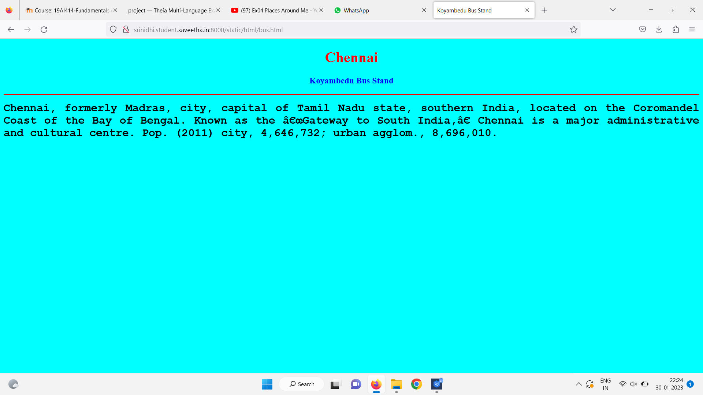

# Places Around Me
## AIM:
To develop a website to display details about the places around my house.

## Design Steps:

### Step 1:
Clone the github repository into Theia IDE.
### Step 2:
Create a new Django project

### Step 3:
Write the needed HTML code.

### Step 4:
Run the Django server and execute the HTML files.
## Code:
```
map.html

<!DOCTYPE html>
<html lang="en">
<head>
<title>My City</title>
</head>
<body>
<h1 align="center">
<font color="red"><b>Chennai</b></font>
</h1>
<h3 align="center">
<font color="blue"><b>Srinidhi (22002716)</b></font>
</h3>
<center>

<map name="MyCity">
<area shape="circle" coords="190,50,20" href="/static/html/vmt.html" title="Vadapalani Murugan Temple">
<area shape="rectangle" coords="230,30,260,60" href="/static/html/srm.html" title="SRM Institut Of Science And Technology">
<area shape="circle" coords="400,350,50" href="/static/html/vk.html" title="Valluvar Kottam">
<area shape="circle" coords="400,200,75" href="/static/html/bus.html" title="T.Nagar  Bus Stand">
<area shape="rectangle" coords="490,150,870,320" href="/static/html/park.html" title="Semmozhi Poonga">
</map>
</center>
</body>
</html>

bus.html

<!DOCTYPE html>
<html lang="en">
<head>
<title>Koyambedu Bus Stand</title>
</head>
<body bgcolor="cyan">
<h1 align="center">
<font color="red"><b>Chennai</b></font>
</h1>
<h3 align="center">
<font color="blue"><b>Koyambedu Bus Stand</b></font>
</h3>
<hr size="3" color="red">
<p align="justify">
<font face="Courier New" size="5">
<b>
Chennai, formerly Madras, city, capital of Tamil Nadu state, southern India, 
located on the Coromandel Coast of the Bay of Bengal. Known as the “Gateway to South India,”
Chennai is a major administrative and cultural centre. Pop. (2011) city, 4,646,732; urban agglom., 8,696,010.
</b>
</font>
</p>
</body>
</html>

park.html

<!DOCTYPE html>
<html lang="en">
<head>
<title>Koyambedu Metro station</title>
</head>
<body bgcolor="lime">
<h1 align="center">
<font color="red"><b>Chennai</b></font>
</h1>
<h3 align="center">
<font color="blue"><b>Koyambedu Metro station</b></font>
</h3>
<hr size="3" color="red">
<p align="justify">
<font face="Georgia" size="5">
The main objectives of Koyambedu Metro station are 
<ul>
Koyambedu Metro station is a Metro railway station on the Line 2 of the Chennai Metro, 
which is one terminal of the current open metro line from St Thomas Mount. 
The station is among the elevated stations along corridor II of the Chennai Metro, Chennai Central–St. 
Thomas Mount stretch. The station will serve the neighbourhoods of Koyambedu, Koyambedu vegetable market, and 
Koyambedu Private Bus Terminus.
</ul>
</font>
</p>
</body>
</html>

vmt.html

<!DOCTYPE html>
<html lang="en">
<head>
<title>Vadapalani murugan temple</title>
</head>
<body bgcolor="pink">
<h1 align="center">
<font color="red"><b>Chennai</b></font>
</h1>
<h3 align="center">
<font color="pink"><b>Vadapalani murugan temple</b></font>
</h3>
<hr size="3" color="red">
<p align="justify">
<font face="Arial" size="5">
<b>
Vadapalani temple represents the grandiose culture of the Hindus which has several shrines of Lord Ganesha, Goddess Meenakshi Amman, Lord Shiva, Goddess Kali, Lord Bhairava, Chokkanadar, Dakshniamurti, Chandikeswara and Mahalakshmi. Lord Ganesha appears as Varasidhi Vinayagar at the left of the southern or the main entrance.
</b>
</font>
</p>
</body>
</html>

vk.html

<!DOCTYPE html>
<html lang="en">
<head>
<title>Koyambedu</title>
</head>
<body bgcolor="orange">
<h1 align="center">
<font color="red"><b>Chennai</b></font>
</h1>
<h3 align="center">
<font color="blue"><b>Koyambedu</b></font>
</h3>
<hr size="3" color="red">
<p align="justify">
<font face="Georgia" size="5">
Koyambedu is a neighbourhood in Chennai, India. Situated in the western part of Chennai city, 
the Koyambedu area has become a major hub of activity in Chennai City after the inauguration of the Koyambedu market in 1996
 and the Chennai Mofussil Bus Terminus (CMBT) in 2002. 
</font>
</p>
</body>
</html>

ghs.html

<!DOCTYPE html>
<html lang="en">
<head>
<title>Semozhi poongak</title>
</head>
<body bgcolor="yellow">
<h1 align="center">
<font color="red"><b>Chennai</b></font>
</h1>
<h3 align="center">
<font color="yellow"><b>Semozhi poongak</b></font>
</h3>
<hr size="3" color="red">
<p align="justify">
<font face="Tahoma" size="5">
Semmozhi Poonga is one of the most visited botanical gardens in all of Chennai. The beautiful landscaping at the garden has not only made it a delight for the daily morning walkers but has also attracted film makers and tourists. A huge parking lot, a canteen that serves delicious refreshments, and a beautiful artificial pond with ducks that are the children’s favorite, Semmozhi Poonga has become a must visit destination in the city.
</font>
</p>
</body>
</html>

```

## Output:





## HTML Validator


## Result:
The program for implementing image map is executed successfully.